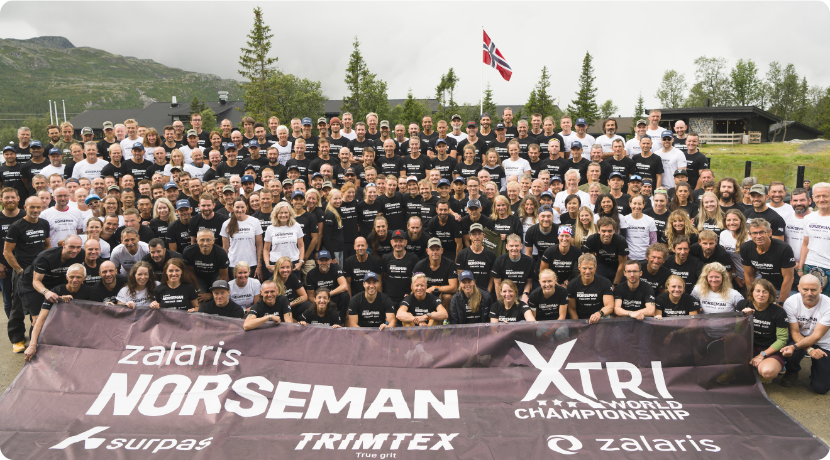

# 👋 Hey there!

 I'm **Sebastian Ullrich**, a multifaceted individual with a passion for technology, good coffee, endurance sports,
and making things happen.

## Professional Roles
- 💻 Master of Computer Scientist
- 🖥️ Software Developer @codecentric
- 🛠 DevOps Engineer
- 🚀 Maker Mentality
- 📦 Product Thinking

## Athletic Achievements
My journey as an extreme endurance athlete has led to several notable accomplishments, including:

- 🇳🇴 [Norseman Black-Shirt Finisher](https://de.wikipedia.org/wiki/Norseman_Xtreme_Triathlon)
- 🇩🇪 [Ironman Frankfurt Finisher](https://de.wikipedia.org/wiki/Ironman_Germany)
- 🇩🇪 [Challenge Roth Finisher](https://de.wikipedia.org/wiki/Challenge_Roth)
- 🇩🇪 Ironman 70.3 Duisburg Finisher
- 🏃‍ 100km DUV German Championships (🥉 3rd Place)
- 🏃‍ Traildorado 24h Trailrunning Finisher
- ⛰️ 75,5km Sachsen Trail Finisher
- ⛰️ 71km Hunsbuckel Trail Finisher
- ⛰️ 60km Ultratail Finisher
- 🎽‍ Berlin Marathon Finisher
- 🎽‍ Hamburg Marathon Finisher
- 🎽‍ Cologne Marathon Finisher
- 🎽‍ Duisburg Marathon Finisher
- 🎽‍ Dresden Half Marathon Finisher
- 🎽‍ Dortmund Half Marathon Finisher
- 🎽‍ Bochum Half Marathon Finisher
- 🎽‍ Dortmund Half Marathon Finisher

I am driven by a relentless pursuit of excellence both in my professional career and in pushing my physical limits as
an endurance athlete. Hard work pays off! Let's connect and explore new horizons together!

[Github](https://github.com/sullrich84) | 
[X](https://twitter.com/sullrich84) | 
[Instagram](https://www.instagram.com/sullrich84/) |
[LinkedIn](https://de.linkedin.com/in/sebastian-ullrich-554023252) | 
[Strava](https://www.strava.com/athletes/15252834)

